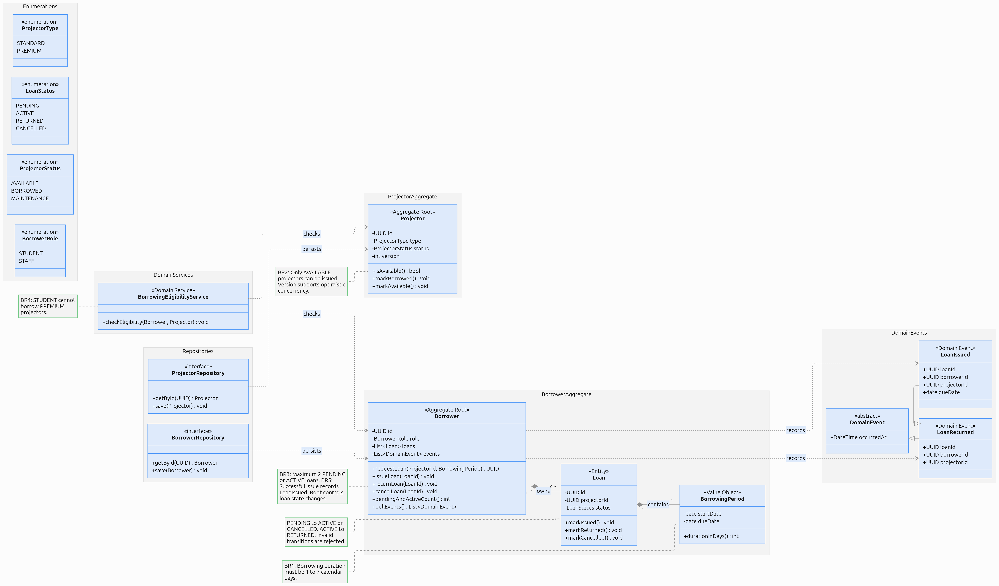

# Projector Borrowing System

A Python domain model for managing projector loans in a school or workplace.
The project uses **Domain-Driven Design (DDD)** concepts to keep borrowing
rules inside the domain instead of spreading them across the application.

> **Project status:** The domain, application, infrastructure, and console
> presentation layers are implemented and tested.

## Domain Model



The model is organized around two aggregate roots:

- **Borrower** controls a borrower's loans and domain events.
- **Projector** controls projector type, availability, and version.

Repositories are responsible for loading and saving aggregates, while the
`BorrowingEligibilityService` checks rules that involve both a borrower and a
projector.

## Borrower Aggregate

The `Borrower` aggregate represents a student or staff member who can request,
receive, return, and cancel projector loans.

### State

| Field | Type | Purpose |
| --- | --- | --- |
| `borrower_id` | `UUID` | Uniquely identifies the borrower |
| `role` | `BorrowerRole` | Identifies the borrower as a student or staff member |
| `loans` | `list[Loan]` | Loans owned by the borrower |
| `events` | `list[DomainEvent]` | Domain events waiting to be published |

### Intended behavior

- `request_loan(projector_id, period)` creates a pending loan.
- `issue_loan(loan_id)` activates an eligible loan.
- `return_loan(loan_id)` marks an active loan as returned.
- `cancel_loan(loan_id)` cancels a pending loan.
- `pending_and_active_count()` counts open loans.
- `pull_events()` returns and clears recorded domain events.

## Business Rules

| Rule | Description |
| --- | --- |
| BR1 | A borrowing period must be between 1 and 7 calendar days. |
| BR2 | Only an available projector can be issued. |
| BR3 | A borrower can have at most two pending or active loans. |
| BR4 | A student cannot borrow a premium projector. |
| BR5 | Issuing and returning loans records the appropriate domain event. |
| BR6 | A stale projector update is rejected using optimistic concurrency. |

Valid loan status transitions are:

```text
PENDING -> ACTIVE
PENDING -> CANCELLED
ACTIVE  -> RETURNED
```

All other transitions should be rejected by the domain model.

## Borrower Roles

The `BorrowerRole` enum currently supports:

```python
class BorrowerRole(Enum):
    STUDENT = "STUDENT"
    STAFF = "STAFF"
```

## Project Structure

```text
src/projector_borrowing/
├── application/              # Application use cases
├── domain/
│   ├── borrowing/
│   │   ├── borrower.py       # Borrower aggregate root
│   │   ├── enums/            # Borrower roles
│   │   ├── events/           # Borrowing domain events
│   │   ├── exceptions/       # Borrowing rule violations
│   │   ├── repositories/     # Borrower repository abstraction
│   │   ├── services/         # Borrowing domain services
│   │   └── valueobject/      # Borrowing value objects
│   ├── projectors/           # Projector domain model
│   └── shared/               # Shared domain building blocks
├── infrastructure/           # Persistence and external integrations
└── presentation/             # User-facing/API layer
```

## Requirements

- Python 3.14 or newer

The application has no external runtime dependencies. Testing uses `pytest`,
`pytest-cov`, and `coverage`.

## Setup

Clone the repository and create a virtual environment:

```bash
git clone <repository-url>
cd projector_borrowing-
python3 -m venv .venv
source .venv/bin/activate
pip install -e .
```

## Usage

The completed borrower API is intended to be used like this:

```python
from uuid import uuid4

from projector_borrowing.domain.borrowing.borrower import Borrower
from projector_borrowing.domain.borrowing.enums import BorrowerRole

borrower = Borrower(
    borrower_id=uuid4(),
    role=BorrowerRole.STUDENT,
)
```

Run the complete request, issue, and return workflow:

```bash
python -m projector_borrowing demo
```

Run all tests with branch coverage:

```bash
python -m pytest --cov
```

## Development Roadmap

- [x] Define the domain UML.
- [x] Add `BorrowerRole`.
- [x] Complete the `Borrower` aggregate.
- [x] Implement `Loan` and `BorrowingPeriod`.
- [x] Implement the `Projector` aggregate.
- [x] Add loan-transition rules.
- [x] Add cross-aggregate projector eligibility rules.
- [x] Add repository interfaces.
- [x] Add borrowing domain events.
- [x] Add borrowing-domain tests.
- [x] Implement application use cases and DTOs.
- [x] Implement in-memory repository adapters.
- [x] Enforce optimistic concurrency.
- [x] Add a runnable console demonstration.
- [x] Verify dependency directions.
- [x] Add explicit BR1-BR6 tests.

## Design Goals

- Keep business rules inside the domain layer.
- Prevent invalid loan state transitions.
- Use value objects for validated concepts such as borrowing periods.
- Record important state changes as domain events.
- Keep persistence concerns outside domain entities.

## Dependency Direction

Dependencies point inward:

```text
presentation -> application -> domain
infrastructure -------------> domain
composition root -> all layers
```

An automated architecture test prevents inner layers from importing outer
layers.
